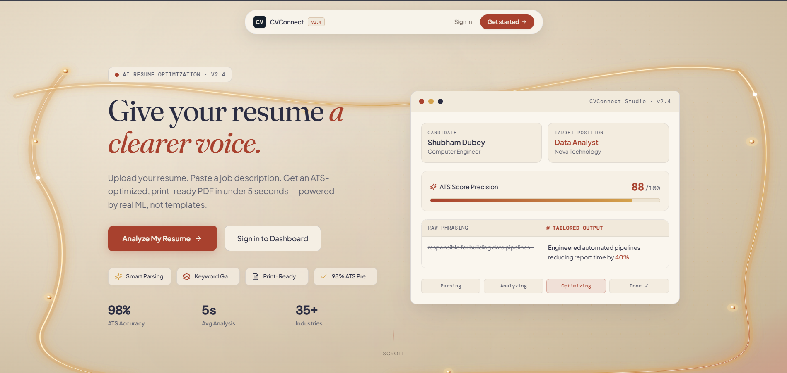
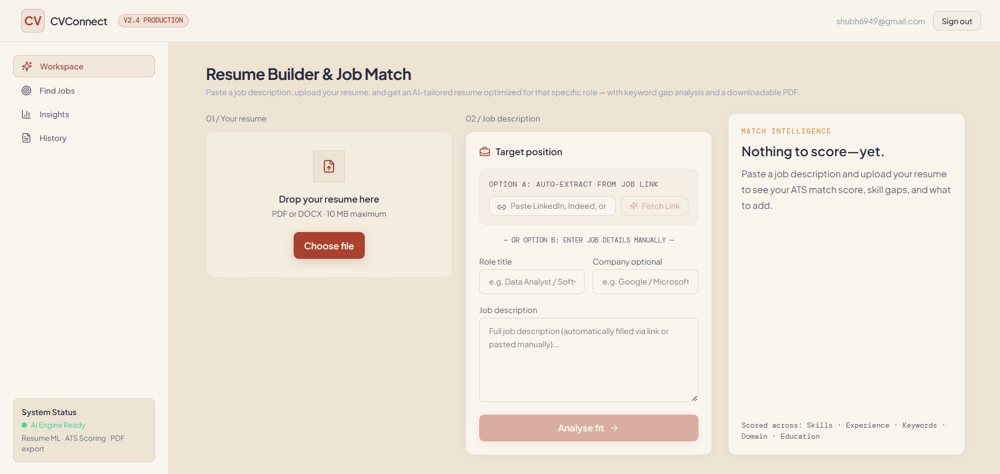
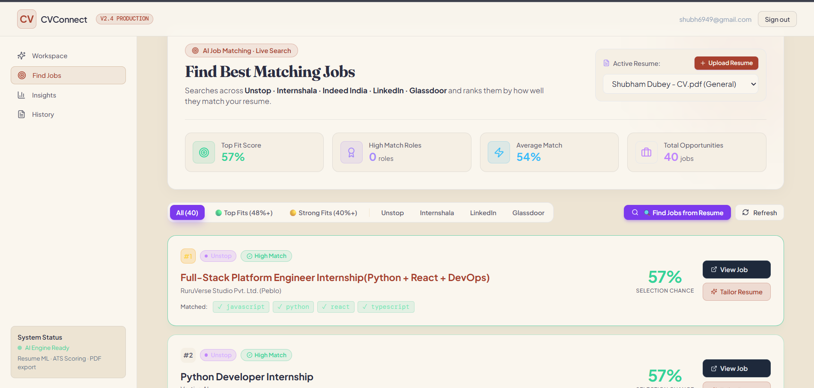
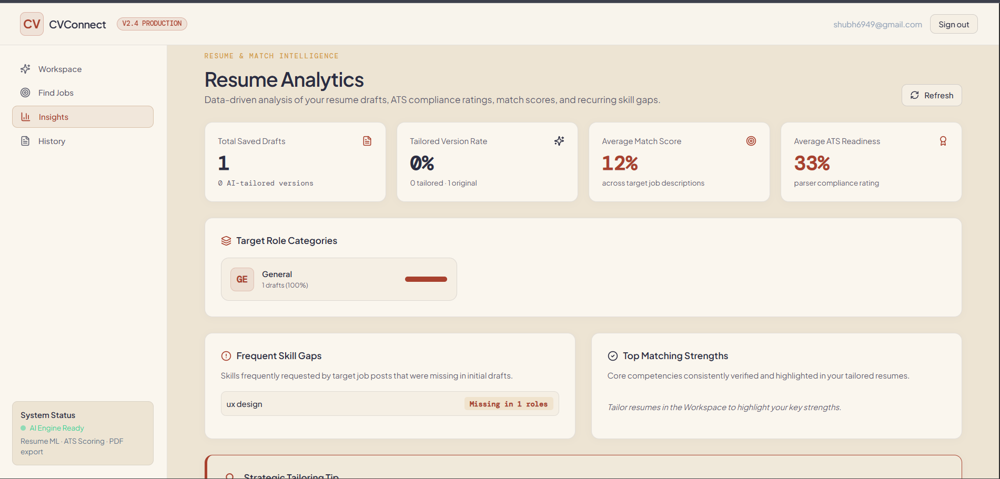
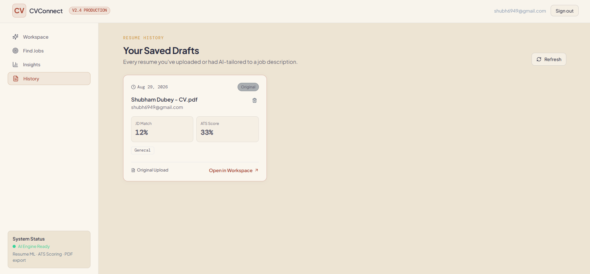

<div align="center">

# 🌿 CVConnect
### AI-Powered Resume Tailoring & Multi-Platform Job Intelligence

[](https://cv-connect-seven.vercel.app)
[](https://cvconnect.onrender.com/health)
[](https://supabase.com)
[](https://api.deepseek.com)
[](https://github.com/Dubey411/CVConnect/actions)

<p align="center">
  <b>Give your resume a clearer voice.</b><br/>
  CVConnect parses your resume, analyzes any target job description or live URL, detects ATS keyword gaps, rewrites bullet points with strong action verbs using DeepSeek V3, and discovers matching live jobs across Unstop, Internshala, and Adzuna.
</p>

[**Explore Live Application ➔**](https://cv-connect-seven.vercel.app)

---

</div>

## 📸 Platform Walkthrough & Screenshots

### 1. Landing Page — "Modern Indian Artisan" Aesthetic
> *Crafted with an "Anavila meets Linear" visual identity: warm undyed cotton canvas (`#EDE4D3`), Fraunces serif typography, luminous golden silk curves, starlight pearls, and interactive dashboard preview.*

<div align="center">
  
</div>

---

### 2. Workspace — Resume Builder & Job Match
> *01 Upload your resume (PDF/DOCX) ➔ 02 Auto-extract job requirements from any URL or paste manually ➔ Real-time ATS match scoring, radar dimensional analysis, and honest bullet-by-bullet rewrite editor.*

<div align="center">
  
</div>

---

### 3. Find Jobs — Live Multi-Platform Opportunity Aggregator
> *Searches live, verified job listings across **Adzuna India**, **Unstop**, **Internshala**, **LinkedIn**, and **Glassdoor**. Automatically ranks every opening against your active resume skills with selection probability scoring.*

<div align="center">
  
</div>

---

### 4. Insights — Career Analytics & ATS Compliance
> *Comprehensive analytics reporting average ATS parser compliance, target role distribution, and high-frequency skill gap analysis across all saved drafts.*

<div align="center">
  
</div>

---

### 5. History — Version Control for Your Career
> *Review every tailored draft created. Compare ATS match scores, track JD requirements, delete outdated versions, or load any draft back into the workspace with a single click.*

<div align="center">
  
</div>

---

## ✨ Key Features

- **🎨 Modern Indian Artisan Design System**: Bespoke color palette built from warm undyed cotton (`#EDE4D3`), hand-pressed khadi paper (`#FAF6EE`), deep madder-root red (`#A8412E`), indigo-charcoal (`#2B2D42`), and muted turmeric (`#D4A24C`).
- **⚡ In-Process High-Speed NLP Engine**: Merged lexical skill extractor (105+ technologies), n-gram TF-IDF cosine similarity matcher, and weak bullet point rewriter running in-memory with sub-5ms latency.
- **🔍 Live Multi-Platform Job Discovery**:
  - **Adzuna API Integration**: Real-time aggregated jobs across India with direct applicant links.
  - **Unstop Discovery**: Active, live hackathons, internships, and hiring challenges.
  - **Internshala Scraper**: Fresh student internships and entry-level positions.
  - **Direct Search Links**: Deep pre-filtered search queries for LinkedIn & Glassdoor India.
- **🤖 DeepSeek V3 & LLM Tailoring**: Context-aware bullet point rewriting that embeds missing JD keywords without hallucinating false credentials.
- **🔐 Google Sign-In & JWT Authentication**: One-click Google Identity Services (GIS) OAuth alongside traditional email/password registration with bcrypt-12 hashing.
- **📄 Print-Ready High-Resolution PDF Export**: Clean, single-page ATS-optimized export layout.

---

## 🏗️ System Architecture

```
CVConnect/
├── frontend/                   # React 18 + Vite 6 + TailwindCSS
│   ├── src/
│   │   ├── components/         # Workspace, MatchLeaderboard, Insights, History
│   │   │   └── landing/        # HeroSection, ATSIntelligenceField, Story Sections
│   │   ├── store.js            # Redux Toolkit centralized workspace state
│   │   └── api.js              # Axios client with auto-refresh token & Vercel fallback
│   └── public/                 # Static assets & favicon
│
├── backend/                    # Node.js 20 Express API + Socket.IO
│   ├── prisma/                 # PostgreSQL Schema & Migrations
│   ├── src/
│   │   ├── routes/             # REST Endpoints (/auth, /resumes, /jobs, /ml)
│   │   ├── services/           # jobFinder, mlEngine, jobScraper, resumeRewriter
│   │   └── lib/                # Prisma client, Redis cache, Logger, CORS handler
│   └── tests/                  # Jest test suites
│
└── doc/                        # Platform UI screenshots & documentation assets
```

---

## 🛠️ Tech Stack

| Domain | Technologies |
| :--- | :--- |
| **Frontend** | React 18, Vite 6, TailwindCSS, Redux Toolkit, Framer Motion, GSAP, Recharts, Lucide Icons |
| **Backend** | Node.js 20, Express, Socket.IO, Prisma ORM, Redis (Upstash), Pino Logger |
| **Database** | PostgreSQL (Hosted on Supabase) |
| **AI / NLP** | DeepSeek V3, OpenRouter, Built-in TF-IDF Lexical Engine |
| **Deployment** | Vercel (Frontend SPA), Render (Backend Container), GitHub Actions (CI) |

---

## 🚦 Getting Started Locally

### 1. Prerequisites
- Node.js 20+
- Bun or npm
- PostgreSQL database (or free [Supabase](https://supabase.com) project)

### 2. Backend Setup
```bash
cd backend
npm install
cp .env.example .env
# Edit .env with your DATABASE_URL, JWT_SECRET, and DEEPSEEK_API_KEY

# Push schema to database
npx prisma db push

# Start development server
npm run dev
```
*Backend runs on `http://localhost:5000` (Health check: `http://localhost:5000/health`).*

### 3. Frontend Setup
```bash
cd frontend
npm install # or bun install
cp .env.example .env
# Edit .env:
# VITE_API_URL=http://localhost:5000/api
# VITE_WEBSOCKET_URL=http://localhost:5000

# Start development server
bun dev # or npm run dev
```
*Frontend runs on `http://localhost:5173`.*

---

## 🌐 Environment Configuration

### Backend (`backend/.env`)
```env
PORT=5000
NODE_ENV=development
CLIENT_ORIGIN=https://cv-connect-seven.vercel.app,http://localhost:5173
DATABASE_URL="postgresql://postgres:[password]@[host]:5432/postgres"
JWT_SECRET=your_jwt_secret_key
JWT_REFRESH_SECRET=your_jwt_refresh_secret_key
DEEPSEEK_API_KEY=your_deepseek_key
ADZUNA_APP_ID=c6660a46
ADZUNA_APP_KEY=07137cb1eb9eec83d065af1b508015f9
```

### Frontend (`frontend/.env`)
```env
VITE_API_URL=https://cvconnect.onrender.com/api
VITE_WEBSOCKET_URL=https://cvconnect.onrender.com
VITE_GOOGLE_CLIENT_ID=your_google_client_id.apps.googleusercontent.com
```

---

## 🧪 Testing

```bash
# Run backend test suite (Jest)
cd backend && npm test

# Run frontend test suite (Vitest)
cd frontend && npm test
```

---

## 📄 License
This project is open-source under the [MIT License](LICENSE).
